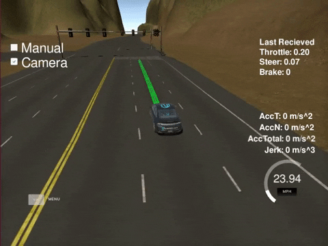

# Self Driving Car Engineer - Capstone Project

This repository hosts the my capstone project for the Udacity Self Driving Car Nanodegree. This project consist of implementing perception, planning and control to get a self driving car around a track.



### Overview


This project implements Perception, Planning and Control through the usage of ROS Nodes that interface with a either a Unity based simulator or Carla, the Udacity Self Driving Car. 

### Planning

The Planning module consist of of two nodes **Waypoint Loader** and **Waypoint Updater**. Both the simulator and the real world test environment have waypoitns that correspoint to the trajectory the car should follow. These ROS Nodes load the load the predetermined base waypoints and update them to incorporate stopping for traffict signals. 

### Perception

The Perception module takes in a video input from a camera located at the front of the car to detect traffic lights and their state. The main component of the Perception module is a Deep Neural Network based on the **SSD Mobilenet** architecture. The perception module is implemented in the **Traffic Light Detector** and **Traffic Light Classifier** nodes. This model was obtained from the [Tensorflow Detection Model Zoo](https://github.com/tensorflow/models/blob/master/research/object_detection/g3doc/detection_model_zoo.md). This model was pre-trained on the COCO dataset and then fined tuned to detect traffic lights. The fine-tuning consists of gathering traffic light images and manualy labelling them and then re-training the model with these added images. The detection model was trained to not only detect traffic lights but also classify them as Red, Yellow or Green. While the model is excelent at detecting traffic lights it performs rather poorly at classifying them based on color. A decent work around is to use the sub-image of the detected traffic light and use a color thresholding baser classifier. The combination of detection model and the color classifier work very well for simulator.

### Control

The control module consist of a PID controller that follows the waypoints obtained from the Planning module as well as a second PID controller to determine throttle. This is implemented in a **Drive by Wire** Node. This node also takes input from the perception node in order to slow down and stop when a red traffic signal is detected by the Perception module.

### Potential Improvements

The ideal perception module would consist of an end-to-end model that would both detect and classify the traffic signals correctly. One approach to achive this would be to change the color space of the images from the car camera as well as re-training the model to do inference with this new input. Another approach would be to use a different deep neural network architecture all together. **Mask R-CNN** based models seem to perform [particularly well](https://paperswithcode.com/sota/object-detection-on-coco) on object detection tasks.

The control module and the PID controller for steering could also be improved to follow the waypoints more closely by both tunning the PID parameters and chaning how often the trajectory is calculated by the DBW Node.


### Usage

1. Clone the project repository

2. Install python dependencies
```
pip install -r requirements.txt
```
3. Make and run styx
```bash
cd ros
catkin_make
source devel/setup.sh
roslaunch launch/styx.launch
```
